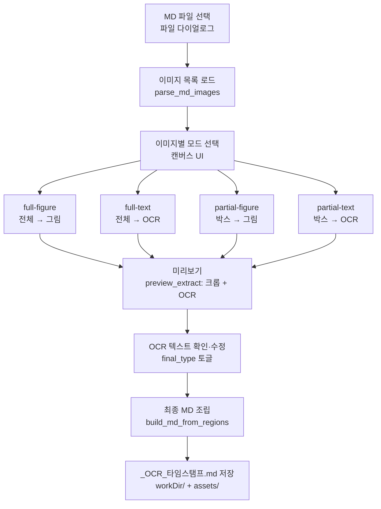
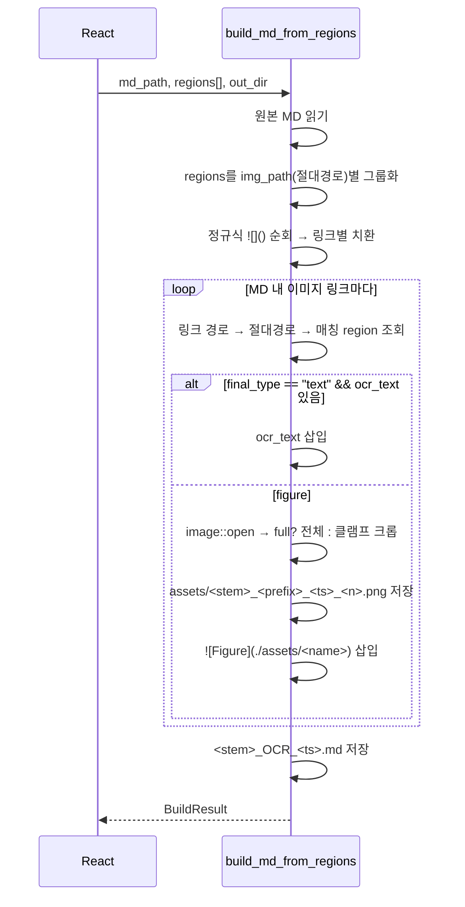

# MD Toolbox — 구현 계획

> 기존 Web Clipper(FastAPI)의 3개 기능을 **순수 Rust + React + Tauri 2** 데스크톱 앱으로
> 재작성한다. Embed / Extract는 완료. 본 문서는 **OCR Studio를 참고 문서의 MD 파일 중심
> 워크플로로 재설계**하는 데 초점을 둔다.
>
> - 작업 디렉터리: `C:\Users\su\pjt\md-toolbox`
> - OCR 흐름 참고: `C:\Users\su\pjt\webclipper-main\.docs\2026-06-21 210926 글자이미지 추출 MD 추출 탭 기능 흐름.md`
> - 백엔드 전략: **순수 Rust** (사이드카·Python 의존 없음)

---

## 1. 기능 범위

| # | 탭 | 핵심 동작 | 상태 |
|---|-----|-----------|------|
| ① | **Embed** | MD 내 로컬 이미지 경로 → Base64 data URI 인라인 치환 | ✅ 완료 |
| ② | **Extract** | MD 내 Base64 + 로컬 링크 → `assets/` 파일로 추출/복사 후 경로 치환 (동명 파일 건너뜀) | ✅ 완료 |
| ③ | **OCR Studio** | MD 안의 이미지를 영역 선택 → Windows OCR 텍스트 / 그림 크롭으로 MD 재구성 | 🔄 **재설계 대상** |

- **저장 경로**: 좌측 하단 위젯에서 지정한 폴더(`workDir`)로 출력. 미지정 시 원본 MD 폴더. (Embed/Extract 공통, OCR Studio도 동일 규칙 적용)

---

## 2. OCR Studio 재설계 — 목표 워크플로

기존 단일 이미지 중심 UI를 폐기하고, 참고 문서의 **MD 파일 중심 6단계 흐름**으로 재구성한다.



### 2.1 데이터 모델 (Rust ↔ TS 공유)

```rust
// 영역 박스 — full 플래그로 전체/부분 구분
struct RegionBox { full: bool, x: f64, y: f64, w: f64, h: f64 }

// 미리보기 요청 단위
struct RegionReq {
    img_path: String,      // MD에서 해석된 절대 경로
    box_: RegionBox,
    orig_type: String,     // "text" | "figure" (모드에서 결정)
}

// 미리보기/편집 결과 단위
struct Region {
    id: String,
    img_path: String,
    box_: RegionBox,
    final_type: String,    // "text" | "figure" (사용자 토글 가능)
    cropped_b64: String,   // 미리보기 PNG data URI
    ocr_text: String,      // 편집 가능
}
```

### 2.2 4개 선택 모드

| 모드 | 박스 좌표 | 결과 |
|------|----------|------|
| `full-figure`   | `{full:true}` | 이미지 전체 → 그림 크롭 |
| `full-text`     | `{full:true}` | 이미지 전체 → OCR |
| `partial-figure`| `{x,y,w,h}` (이미지 자연 좌표) | 드래그 영역 → 그림 크롭 |
| `partial-text`  | `{x,y,w,h}` (이미지 자연 좌표) | 드래그 영역 → OCR |

**좌표 스케일 변환** (캔버스 표시 좌표 → 이미지 자연 좌표):
```
scaleRatio = naturalWidth / clientWidth
box.x = round(canvasX * scaleRatio)
```

---

## 3. Tauri Commands (Rust 인터페이스)

기존 빌딩 블록(`crop_image_b64`, `read_image_b64`, `ocr_text`, `parse_md_images`)을 재활용하고,
오케스트레이션 커맨드 2개를 신규 추가한다.

| 커맨드 | 역할 | 상태 |
|--------|------|------|
| `parse_md_images(md_path)` | MD 파싱 → `{path, alt}[]` (절대경로 해석, 존재 확인) | ✅ 재사용 |
| `read_image_b64(img_path)` | 이미지 → data URI (캔버스 표시용) | ✅ 재사용 |
| `ocr_text(img_path, box?)` | 영역 OCR 라인 텍스트 (단일 재OCR에도 사용) | ✅ 재사용 |
| `crop_image_b64(img_path, box)` | 영역 크롭 → PNG data URI (미리보기) | ✅ 재사용 |
| **`preview_extract(regions: Vec<RegionReq>)`** | 영역별 크롭 + (text면 OCR) → `Vec<Region>` 일괄 반환 | 🆕 신규 |
| **`build_md_from_regions(md_path, regions, out_dir?)`** | 최종 MD 조립 + 그림 PNG 저장 | 🆕 신규 |

```rust
#[tauri::command]
fn preview_extract(regions: Vec<RegionReq>) -> Result<Vec<Region>, String>;
// 각 region: 크롭 b64 생성, orig_type=="text"면 ocr_text 채움
// final_type = orig_type 기본값

#[tauri::command]
fn build_md_from_regions(
    md_path: String,
    regions: Vec<Region>,
    out_dir: Option<String>,   // workDir, 없으면 MD 폴더
) -> Result<BuildResult, String>;
// → { out_path, text_count, figure_count, saved_files }
```

> 다중 이미지 진행률이 필요하면 `app_handle.emit("ocr:progress", {current,total})`.
> (1차 구현은 동기 처리로 충분 — 진행률은 선택)

---

## 4. 최종 조립 로직 (`build_md_from_regions`)

참고 문서의 `_run_manual_extract` / `replace_image` 콜백을 Rust로 포팅.



**치환 규칙:**
- 한 이미지에 여러 region이 매핑되면 `\n\n`으로 이어 붙임 (참고 문서와 동일).
- region 없는 이미지 링크는 **원본 그대로 유지** (원본 충실성 원칙).
- `final_type == "text"`인데 `ocr_text`가 비면 → 그림으로 폴백하지 않고 빈 텍스트 처리 여부는 구현 시 결정(기본: 원본 링크 유지).

### 4.1 출력 명명 규칙

```
원본:  <stem>.md
출력:  <stem>_OCR_<yyyyMMddHHmmss>.md
그림:  assets/<stem>_fig_<ts>_<n>.png   (figure 영역)
       assets/<stem>_txt_<ts>_<n>.png   (text 모드였으나 figure로 확정된 영역)
```

- 타임스탬프로 매 실행 고유 파일명 → **덮어쓰기 없음**.
- 저장 위치: `out_dir`(workDir) 또는 MD 폴더, `assets/`는 그 하위.

---

## 5. 프런트엔드 재구성 (`src/components/ocr/`)

기존 단일 이미지 컴포넌트를 MD 중심 다중 이미지 워크플로로 교체.

```
ocr/
├─ ocr-tab.tsx          # MD 선택 → 이미지 목록 → 단계 진행 셸 (상태 머신)
├─ image-canvas.tsx     # ★ 재활용/개선: 박스 드래그, 자연좌표 변환
├─ mode-selector.tsx    # 🆕 이미지별 4모드 라디오 + 박스 그리기 토글
└─ region-preview.tsx   # 🆕 region 카드: 크롭 미리보기 + OCR textarea +
                        #    text↔figure 토글 + 단일 재OCR 버튼
```

**상태 흐름 (ocr-tab):**
1. `select` — MD 파일 선택 (다이얼로그) → `parse_md_images`
2. `assign` — 이미지별 모드 선택 + partial이면 박스 드래그 → `RegionReq[]` 누적
3. `preview` — `preview_extract` 호출 → `Region[]` 표시
4. `edit` — region별 `ocr_text` 수정 / `final_type` 토글 / 단일 재OCR(`ocr_text`)
5. `build` — `build_md_from_regions` → 결과 경로 토스트 + 폴더 열기

**좌표/캔버스**: 기존 `image-canvas.tsx`의 자연좌표 변환 로직 재사용.

---

## 6. invoke 래퍼 (`src/lib/invoke.ts`) 추가분

```ts
export interface RegionBox { full: boolean; x: number; y: number; w: number; h: number; }
export interface RegionReq { imgPath: string; box: RegionBox; origType: "text"|"figure"; }
export interface Region {
  id: string; imgPath: string; box: RegionBox;
  finalType: "text"|"figure"; croppedB64: string; ocrText: string;
}
export interface BuildResult {
  outPath: string; textCount: number; figureCount: number; savedFiles: string[];
}

export function cmdPreviewExtract(regions: RegionReq[]): Promise<Region[]>;
export function cmdBuildMdFromRegions(
  mdPath: string, regions: Region[], outDir?: string
): Promise<BuildResult>;
```

> 기존 단일 이미지용 `cmdOcrWordBoxes` / `cmdAutoDetect` / `cmdDetectContours`는
> 새 워크플로에서 직접 쓰지 않음 → **자동 검출은 선택적 보조**로만 유지(8절).

---

## 7. 단계별 구현 계획 (검증 기준 포함)

```
Phase A  백엔드 커맨드
  A1. preview_extract 구현 (crop + 조건부 OCR, RegionReq→Region)
      검증: 샘플 이미지 + 박스 → cargo test 로 cropped_b64/ocr_text 채워짐 확인
  A2. build_md_from_regions 구현 (그룹화 + 정규식 치환 + 그림 저장 + 명명규칙)
      검증: text/figure 섞인 regions → _OCR_<ts>.md 생성, assets PNG 저장,
            text는 본문 삽입·figure는  삽입, 미매핑 링크 원본 유지

Phase B  프런트 재구성
  B1. ocr-tab 상태 머신 (select→assign→preview→edit→build)
  B2. mode-selector (4모드 + partial 박스) / region-preview (편집 카드)
  B3. image-canvas 자연좌표 변환 연결
      검증: MD 선택 → 이미지 목록 → 모드 지정 → 미리보기 → 편집 → 빌드 end-to-end

Phase C  마감
  C1. 진행률 이벤트(선택), 결과 폴더 열기(opener)
  C2. 에지: 한글 경로, 이미지 누락, OCR 언어팩 부재 시 메시지
      검증: 한글 파일명 MD로 전체 흐름 동작
```

---

## 8. 자동 검출(figures.rs) 처리 방침

- 기존 `auto_detect` / `detect_contours_fullwidth`(imageproc 기반)는 **삭제하지 않고 보존**하되,
  새 워크플로의 필수 경로에서는 제외한다.
- 추후 `assign` 단계에서 "그림 영역 자동 추천" **보조 버튼**으로 재연결 가능 (선택 항목).
- 1차 타깃은 **수동 모드 선택 + 박스 지정** (참고 문서 흐름과 동일).

---

## 9. 의존성

현재 `Cargo.toml` 그대로 충분 (`windows`, `image`, `imageproc`, `regex`, `base64`, `serde`).
신규 커맨드는 기존 크레이트만 사용 → **의존성 추가 없음**.

---

## 10. 결정 사항 (확정)

1. **미매핑 이미지**: 모드 미지정 이미지는 출력 MD에서 **원본 링크 그대로 유지** (원본 충실성). ✅
2. **단일 이미지 빠른 모드**: 기존 "이미지 1장 드롭 → OCR" 편의 기능 **제거**, MD 파일 중심으로 일원화. ✅
3. **자동 도형 검출(figures.rs)**: 코드 보존, 필수 경로 제외. `assign` 단계의 **"그림 영역 추천" 보조 버튼**으로만 선택 연결. ✅
4. **figure 저장 형식**: **PNG 고정** (참고 문서 규칙).
5. **OCR 언어**: ko-KR + en-US 고정.
```
